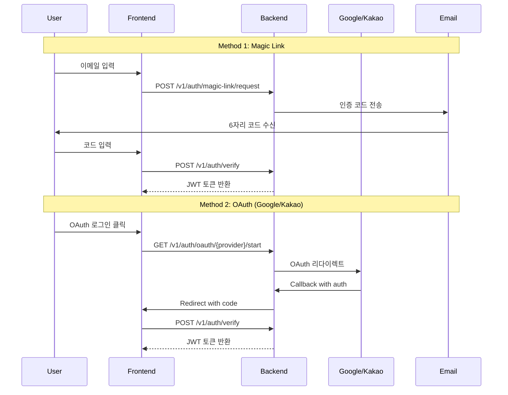

# Frontend API Specification v1.0

> **목적**: 프론트엔드 개발자를 위한 실전 API 스펙  
> **기준**: 실제 구현된 코드 기반 (2026-01-22)  
> **Base URL**: `https://api.service.com/v1`

---

## 📋 목차

1. [기본 정보](#1-기본-정보)
2. [인증 (Auth)](#2-인증-auth)
3. [사용자 정보 (User)](#3-사용자-정보-user)
4. [거래소 키 관리 (Exchange Keys)](#4-거래소-키-관리-exchange-keys)
5. [거래 이력 (Trade Logs)](#5-거래-이력-trade-logs)
6. [실시간 거래 정보 (Trade Info)](#6-실시간-거래-정보-trade-info)
7. [Webhook](#7-webhook)
8. [에러 처리](#8-에러-처리)

---

### 공통 응답 포맷

> [!IMPORTANT]
> ResponseInterceptor가 응답에 `request_id`, `timestamp` 메타 데이터를 자동으로 추가합니다.
>
> 실제 API 응답 구조:
>
> - `success`: 요청 성공 여부 (boolean)
> - `data`: 실제 응답 데이터 (컨트롤러에서 반환한 값)
> - `request_id`: 요청 추적 ID
> - `timestamp`: 응답 생성 시각 (ISO 8601)

**✅ 성공 응답**

```json
{
  "ok": true,

  "data": {
    /* 실제 응답 데이터 */
  },
  "requestId": "req-abc123",
  "timestamp": "2026-01-24T05:30:36.950Z"
}
```

**❌ 실패 응답**

```json
{
  "ok": false,

  "error": {
    "code": "ERROR_CODE",
    "message": "에러 메시지",
    "details": {}
  },
  "requestId": "req-abc123",
  "timestamp": "2026-01-24T05:30:36.950Z"
}
```

> [!NOTE]
> **데이터 접근 경로**: 실제 비즈니스 데이터는 `response.data.data`에 위치합니다.
> 프론트엔드에서 `unwrapResponse(response.data)` 유틸리티를 사용하여 `data.data`를 추출할 수 있습니다.

### 인증 헤더

모든 인증 필요 API는 다음 헤더 필수:

```http
Authorization: Bearer <accessToken>
```

### 페이징 규칙

| 파라미터 | 타입    | 기본값 | 설명                        |
| -------- | ------- | ------ | --------------------------- |
| `page`   | integer | 1      | 페이지 번호 (1부터 시작)    |
| `limit`  | integer | 20     | 페이지당 항목 수 (최대 100) |

**페이징 응답 형식:**

```json
{
  "ok": true,
  "data": {
    "items": [
      /* 데이터 배열 */
    ],
    "pagination": {
      "page": 1,
      "limit": 20,
      "total": 152
    }
  }
}
```

---

## 2. 인증 (Auth)

> [!IMPORTANT]
> 이 서비스는 **비밀번호 없는 인증(Passwordless Authentication)**을 사용합니다.
>
> - Magic Link (이메일 인증)
> - OAuth 2.0 (Google, Kakao)

### 2.1 인증 플로우 개요



---

#### 2.1.1 토큰 관리 및 프론트엔드 구현 가이드

> [!TIP]
> 프론트엔드에서 토큰을 안전하게 관리하고, 유저 정보를 전역 상태로 관리하는 권장 패턴입니다.

**핵심 컴포넌트:**

| 컴포넌트          | 역할                        | 파일 위치              |
| ----------------- | --------------------------- | ---------------------- |
| tokenStorage      | 토큰 저장/조회/삭제         | `lib/api/client.ts`    |
| Axios Interceptor | 자동 토큰 첨부, 401 시 갱신 | `lib/api/client.ts`    |
| useAuthStore      | 유저 정보 전역 상태         | `stores/auth-store.ts` |
| useMe             | 서버에서 유저 정보 조회     | `hooks/use-auth.ts`    |

**권장 플로우:**

```
1. 로그인 성공 (POST /v1/auth/verify)
   ↓
2. 토큰 저장 (localStorage)
   - accessToken: 15분 만료
   - refreshToken: 30일 만료
   ↓
3. 유저 정보를 전역 상태에 저장 (Zustand)
   ↓
4. 이후 API 호출 시:
   - Interceptor가 자동으로 토큰 첨부
   - 401 발생 시 자동 갱신 시도
   - 갱신 실패 시 로그인 페이지로 리다이렉트
```

**토큰 저장소 예시:**

```typescript
export const tokenStorage = {
  setTokens: (access: string, refresh: string) => {
    localStorage.setItem("accessToken", access);
    localStorage.setItem("refreshToken", refresh);
  },
  clearTokens: () => {
    localStorage.removeItem("accessToken");
    localStorage.removeItem("refreshToken");
  },
  hasTokens: () => !!localStorage.getItem("accessToken"),
};
```

**로그인 성공 후 처리:**

```typescript
const { mutate: verify } = useAuthVerify();

verify(
  { code: authCode },
  {
    onSuccess: (data) => {
      tokenStorage.setTokens(data.accessToken, data.refreshToken);
      setUser(data.user); // Zustand 전역 상태에 저장
      navigate("/dashboard");
    },
  },
);
```

> [!NOTE]
> **보안 팁**: 더 높은 보안이 필요하면 `refreshToken`은 httpOnly 쿠키에 저장하세요.

---

### 2.2 Magic Link 인증

#### 2.2.1 Magic Link 요청

매직 링크를 이메일로 요청합니다. 6자리 인증 코드가 이메일로 전송됩니다.

```http
POST /v1/auth/magic-link/request
Content-Type: application/json
```

**Request Body**

```json
{
  "email": "user@example.com",
  "redirectUrl": "https://yourapp.com/auth/callback"
}
```

**필드 설명:**

- `email`: 사용자 이메일 주소 (필수)
- `redirect_url`: 인증 완료 후 리다이렉트할 URL (필수)

**Response 202 - Accepted**

```json
{
  "ok": true,

  "data": {
    "message": "Magic link sent to your email",
    "code": "123456"
  },
  "requestId": "req-abc",
  "timestamp": "2026-01-24T05:30:36.950Z"
}
```

> [!NOTE]
> `code` 필드는 **개발 환경에서만** 응답에 포함됩니다. 프로덕션에서는 이메일로만 전송됩니다.

**Error 400 - VALIDATION_ERROR**

```json
{
  "ok": false,
  "error": {
    "code": "VALIDATION_ERROR",
    "message": "Invalid email format"
  }
}
```

#### 2.2.2 Magic Link 인증 코드 검증 (구 방식)

> [!WARNING]
> 이 엔드포인트는 **deprecated**입니다. 대신 `POST /v1/auth/verify`를 사용하세요.

```http
POST /v1/auth/magic-link/verify
Content-Type: application/json
```

**Request Body**

```json
{
  "token": "eyJhbGciOiJIUzI1NiIsInR5cCI6IkpXVCJ9..."
}
```

**Response 200**

```json
{
  "ok": true,

  "data": {
    "accessToken": "eyJhbGciOiJIUzI1NiIsInR5cCI6IkpXVCJ9.eyJzdWIiOiI1NTBlODQwMC1lMjliLTQxZDQtYTcxNi00NDY2NTU0NDAwMDAiLCJlbWFpbCI6InVzZXJAZXhhbXBsZS5jb20ifQ.abc123",
    "refreshToken": "a1b2c3d4e5f6g7h8i9j0k1l2m3n4o5p6",
    "user": {
      "id": "550e8400-e29b-41d4-a716-446655440000",
      "email": "user@example.com",
      "role": "user",
      "profile": {},
      "createdAt": "2026-01-15T10:00:00Z"
    }
  },
  "requestId": "req-xyz",
  "timestamp": "2026-01-24T05:30:36.950Z"
}
```

---

### 2.3 OAuth 인증 (Google)

#### 2.3.1 Google OAuth 시작

Google OAuth 인증 페이지로 리다이렉트합니다.

```http
GET /v1/auth/oauth/google/start?redirect_uri=https://yourapp.com/auth/callback
```

**Query Parameters**
| 파라미터 | 타입 | 필수 | 설명 |
|---------|------|------|------|
| `redirect_uri` | string | Yes | 인증 완료 후 리다이렉트할 URL |

**Response 302 - Redirect**

사용자가 Google 인증 페이지로 리다이렉트됩니다.

#### 2.3.2 Google OAuth Callback

Google에서 인증 완료 후 자동 호출되는 콜백 엔드포인트입니다. **프론트엔드에서 직접 호출하지 마세요.**

```http
GET /v1/auth/oauth/google/callback
```

**Response 302 - Redirect**

```
https://yourapp.com/auth/callback?code=abc123xyz
```

사용자를 지정한 `redirect_uri`로 리다이렉트하며, authorization code를 쿼리 파라미터로 전달합니다.

**Error 401 - Unauthorized**

```http
https://yourapp.com/auth/callback?error=unauthorized
```

---

### 2.4 OAuth 인증 (Kakao)

#### 2.4.1 Kakao OAuth 시작

Kakao OAuth 인증 페이지로 리다이렉트합니다.

```http
GET /v1/auth/oauth/kakao/start?redirect_uri=https://yourapp.com/auth/callback
```

**Query Parameters**
| 파라미터 | 타입 | 필수 | 설명 |
|---------|------|------|------|
| `redirect_uri` | string | Yes | 인증 완료 후 리다이렉트할 URL |

**Response 302 - Redirect**

사용자가 Kakao 인증 페이지로 리다이렉트됩니다.

#### 2.4.2 Kakao OAuth Callback

Kakao에서 인증 완료 후 자동 호출되는 콜백 엔드포인트입니다. **프론트엔드에서 직접 호출하지 마세요.**

```http
GET /v1/auth/oauth/kakao/callback
```

**Response 302 - Redirect**

```
https://yourapp.com/auth/callback?code=abc123xyz
```

> [!NOTE]
> Kakao는 이메일 정보 제공이 선택사항입니다. 이메일이 없는 경우 `{kakao_id}@kakao.com` 형식의 fallback 이메일이 자동 생성됩니다.

**Error 401 - Unauthorized**

```http
https://yourapp.com/auth/callback?error=unauthorized
```

---

### 2.5 통합 토큰 검증 (권장)

Magic Link 토큰 또는 OAuth authorization code를 JWT 토큰으로 교환합니다.

```http
POST /v1/auth/verify
Content-Type: application/json
```

**Request Body**

```json
{
  "code": "abc123xyz",
  "redirectUri": "https://yourapp.com/auth/callback"
}
```

**필드 설명:**

- `code`: Magic Link 토큰 또는 OAuth authorization code (필수)
- `redirect_uri`: OAuth 플로우의 경우 필수, Magic Link는 선택사항

**Response 200**

```json
{
  "ok": true,

  "data": {
    "accessToken": "eyJhbGciOiJIUzI1NiIsInR5cCI6IkpXVCJ9.eyJzdWIiOiI1NTBlODQwMC1lMjliLTQxZDQtYTcxNi00NDY2NTU0NDAwMDAiLCJlbWFpbCI6InVzZXJAZXhhbXBsZS5jb20iLCJhcHBJZCI6ImRlZmF1bHQiLCJyb2xlIjoidXNlciJ9.abc123",
    "refreshToken": "a1b2c3d4e5f6g7h8i9j0k1l2m3n4o5p6",
    "user": {
      "id": "550e8400-e29b-41d4-a716-446655440000",
      "email": "user@example.com",
      "appId": "default",
      "role": "user",
      "profile": {
        "displayName": "John Doe",
        "photo": "https://example.com/photo.jpg"
      },
      "createdAt": "2026-01-15T10:00:00Z",
      "updatedAt": "2026-01-22T10:00:00Z"
    }
  },
  "requestId": "req-verify",
  "timestamp": "2026-01-24T05:30:36.950Z"
}
```

**토큰 만료 시간:**

- `accessToken`: 15분
- `refreshToken`: 30일

**Error 401 - UNAUTHORIZED**

```json
{
  "ok": false,
  "error": {
    "code": "UNAUTHORIZED",
    "message": "Invalid or expired token"
  }
}
```

**Error 401 - Token Already Used**

```json
{
  "ok": false,
  "error": {
    "code": "UNAUTHORIZED",
    "message": "Token already used"
  }
}
```

---

### 2.6 토큰 갱신 (Refresh)

Access token이 만료되었을 때 refresh token으로 새로운 access token을 발급받습니다.

```http
POST /v1/auth/refresh
Content-Type: application/json
```

**Request Body**

```json
{
  "refreshToken": "a1b2c3d4e5f6g7h8i9j0k1l2m3n4o5p6"
}
```

**Response 200**

```json
{
  "ok": true,

  "data": {
    "accessToken": "eyJhbGciOiJIUzI1NiIsInR5cCI6IkpXVCJ9.eyJzdWIiOiI1NTBlODQwMC1lMjliLTQxZDQtYTcxNi00NDY2NTU0NDAwMDAifQ.new_token"
  },
  "requestId": "req-refresh",
  "timestamp": "2026-01-24T05:30:36.950Z"
}
```

**Error 401 - Invalid Refresh Token**

```json
{
  "ok": false,
  "error": {
    "code": "UNAUTHORIZED",
    "message": "Invalid refresh token"
  }
}
```

**Error 401 - Expired Refresh Token**

```json
{
  "ok": false,
  "error": {
    "code": "UNAUTHORIZED",
    "message": "Refresh token has expired"
  }
}
```

---

### 2.7 로그아웃

Refresh token을 무효화하여 로그아웃합니다.

```http
POST /v1/auth/logout
Content-Type: application/json
```

**Request Body**

```json
{
  "refreshToken": "a1b2c3d4e5f6g7h8i9j0k1l2m3n4o5p6"
}
```

**필드 설명:**

- `refreshToken`: 무효화할 refresh token (선택사항)

**Response 200**

```json
{
  "ok": true,

  "data": {
    "message": "Logged out successfully"
  },
  "requestId": "req-logout",
  "timestamp": "2026-01-24T05:30:36.950Z"
}
```

> [!TIP]
> 프론트엔드에서는 로그아웃 시 로컬 스토리지의 accessToken과 refreshToken을 모두 삭제해야 합니다.

**사용 예시:**

```typescript
// 로그아웃 처리
async function logout() {
  const refreshToken = localStorage.getItem("refreshToken");

  // 1. 서버에 로그아웃 요청
  if (refreshToken) {
    await fetch("/v1/auth/logout", {
      method: "POST",
      headers: { "Content-Type": "application/json" },
      body: JSON.stringify({ refreshToken: refreshToken }),
    });
  }

  // 2. 로컬 토큰 삭제
  localStorage.removeItem("accessToken");
  localStorage.removeItem("refreshToken");

  // 3. 로그인 페이지로 리다이렉트
  window.location.href = "/login";
}
```

---

### 2.8 계정 관리

#### 2.8.1 내 정보 조회

현재 로그인한 사용자 정보 조회

```http
GET /v1/me
Authorization: Bearer <accessToken>
```

**Response 200**

```json
{
  "ok": true,

  "data": {
    "id": "550e8400-e29b-41d4-a716-446655440000",
    "email": "user@example.com",
    "appId": "default",
    "role": "user",
    "profile": {
      "displayName": "John Doe",
      "photo": "https://example.com/photo.jpg",
      "nickname": "JohnD"
    },
    "createdAt": "2026-01-15T10:00:00Z",
    "updatedAt": "2026-01-22T10:00:00Z",
    "deletedAt": null
  },
  "requestId": "req-me",
  "timestamp": "2026-01-24T05:30:36.950Z"
}
```

**Error 401 - Unauthorized**

```json
{
  "ok": false,
  "error": {
    "code": "UNAUTHORIZED",
    "message": "Authentication required"
  }
}
```

**Error 404 - User Not Found**

```json
{
  "ok": false,
  "error": {
    "code": "NOT_FOUND",
    "message": "User not found"
  }
}
```

#### 2.8.2 프로필 수정

사용자 프로필 정보를 수정합니다.

```http
PATCH /v1/me
Authorization: Bearer <accessToken>
Content-Type: application/json
```

**Request Body**

```json
{
  "nickname": "NewNickname"
}
```

**필드 설명:**

- `nickname`: 사용자 닉네임 (선택사항)

**Response 200**

```json
{
  "ok": true,

  "data": {
    "id": "550e8400-e29b-41d4-a716-446655440000",
    "email": "user@example.com",
    "appId": "default",
    "role": "user",
    "profile": {
      "displayName": "John Doe",
      "photo": "https://example.com/photo.jpg",
      "nickname": "NewNickname"
    },
    "createdAt": "2026-01-15T10:00:00Z",
    "updatedAt": "2026-01-22T11:00:00Z",
    "deletedAt": null
  },
  "requestId": "req-patch-me",
  "timestamp": "2026-01-24T05:30:36.950Z"
}
```

**Error 404 - User Not Found**

```json
{
  "ok": false,
  "error": {
    "code": "NOT_FOUND",
    "message": "User not found"
  }
}
```

#### 2.8.3 계정 삭제

현재 로그인한 사용자의 계정을 **Soft Delete** 합니다.

```http
DELETE /v1/me
Authorization: Bearer <accessToken>
```

**Response 204 - No Content**

요청 성공 시 응답 본문 없음

**동작 설명:**

- Soft Delete 방식으로 `deleted_at` 필드에 삭제 시각 기록
- 관련된 모든 refresh token 무효화
- 사용자 데이터는 일정 기간 보관 후 영구 삭제
- 삭제된 계정으로는 로그인 불가

**Error 404 - User Not Found**

```json
{
  "ok": false,
  "error": {
    "code": "NOT_FOUND",
    "message": "User not found"
  }
}
```

> [!CAUTION]
> 계정 삭제는 되돌릴 수 없습니다. 삭제 전 사용자에게 확인 절차를 거치는 것을 권장합니다.

**사용 예시:**

```typescript
// 계정 삭제 처리
async function deleteAccount() {
  // 1. 사용자 확인
  const confirmed = confirm(
    "정말로 계정을 삭제하시겠습니까? 이 작업은 되돌릴 수 없습니다.",
  );
  if (!confirmed) return;

  // 2. 계정 삭제 요청
  const response = await fetch("/v1/me", {
    method: "DELETE",
    headers: {
      Authorization: `Bearer ${localStorage.getItem("accessToken")}`,
    },
  });

  if (response.status === 204) {
    // 3. 로컬 토큰 삭제
    localStorage.removeItem("accessToken");
    localStorage.removeItem("refreshToken");

    // 4. 로그인 페이지로 리다이렉트
    alert("계정이 삭제되었습니다.");
    window.location.href = "/login";
  }
}
```

---

## 3. 사용자 정보 (User)

### 3.1 Webhook URL 조회

TradingView에서 사용할 Webhook URL 생성

```http
GET /users/webhook
Authorization: Bearer <token>
```

**Query Parameters**
| 파라미터 | 타입 | 필수 | 기본값 | 설명 |
|---------|------|------|--------|------|
| `provider` | string | No | binance | Provider 이름 |

**Response 200**

```json
{
  "ok": true,

  "data": {
    "webhook_url": "https://api.service.com/v1/webhook/binance/a3c1b2d4-5e6f-7a8b-9c0d-e1f2a3b4c5d6",
    "provider": "binance"
  },
  "requestId": "req-webhook",
  "timestamp": "2026-01-24T05:30:36.950Z"
}
```

**사용 예시:**

1. 이 URL을 TradingView Alert Webhook URL에 입력
2. TradingView에서 알림 발생 시 자동으로 거래 실행

---

## 4. 거래소 키 관리 (Exchange Keys)

### 4.1 거래소 키 등록

**✅ 구현 완료** - `src/modules/exchange-keys`

```http
POST /users/keys
Authorization: Bearer <token>
Content-Type: application/json
```

**Request Body**

```json
{
  "exchange": "binance",
  "label": "Main Account",
  "accessKey": "AKxxxxxxxxxxxxxx",
  "secretKey": "SKyyyyyyyyyyyyyy"
}
```

**필드 검증:**

- `exchange`: 필수, 최대 50자
- `label`: 필수, 최대 100자 (식별용 라벨)
- `accessKey`: 필수
- `secretKey`: 필수 (AWS KMS로 암호화 저장)

**Response 201**

```json
{
  "ok": true,

  "data": {
    "keyId": "550e8400-e29b-41d4-a716-446655440000"
  },
  "requestId": "req-abc",
  "timestamp": "2026-01-24T05:30:36.950Z"
}
```

**Error 409 - DUPLICATE_KEY**

```json
{
  "ok": false,
  "error": {
    "code": "DUPLICATE_KEY",
    "message": "이미 등록된 API 키입니다"
  }
}
```

---

### 4.2 거래소 키 목록 조회

**✅ 구현 완료** - `src/modules/exchange-keys`

```http
GET /users/keys
Authorization: Bearer <token>
```

**Response 200**

```json
{
  "ok": true,

  "data": [
    {
      "keyId": "550e8400-e29b-41d4-a716-446655440000",
      "exchange": "binance",
      "label": "Main Account",
      "accessKeyMasked": "AK***1234",
      "createdAt": "2026-01-15T10:00:00Z"
    },
    {
      "keyId": "660e8400-e29b-41d4-a716-446655440001",
      "exchange": "binance",
      "label": "Test Account",
      "accessKeyMasked": "AK***5678",
      "createdAt": "2026-01-18T14:30:00Z"
    }
  ],
  "requestId": "req-2ek",
  "timestamp": "2026-01-24T05:30:36.950Z"
}
```

**필드 설명:**

- `accessKeyMasked`: 앞 2자리 + `***` + 뒤 4자리 (보안)
- `secretKey`는 응답에 절대 포함되지 않음

---

### 4.3 거래소 키 삭제

**✅ 구현 완료** - `src/modules/exchange-keys`

```http
DELETE /users/keys/:key_id
Authorization: Bearer <token>
```

**Response 200**

```json
{
  "ok": true,

  "data": {},
  "requestId": "req-delete-key",
  "timestamp": "2026-01-24T05:30:36.950Z"
}
```

**Error 404 - KEY_NOT_FOUND**

```json
{
  "ok": false,
  "error": {
    "code": "KEY_NOT_FOUND",
    "message": "해당 키를 찾을 수 없습니다"
  }
}
```

---

### 4.4 거래소 키 검증

**❌ 미구현** (추후 추가 예정)

API 키가 유효한지, 필요한 권한이 있는지 검증

```http
POST /users/keys/:key_id/verify
Authorization: Bearer <token>
```

**예상 Response 200**

```json
{
  "ok": true,

  "data": {
    "keyId": 15,
    "valid": true,
    "permissions": {
      "spotTrading": true,
      "futuresTrading": true,
      "marginTrading": false,
      "withdraw": false
    },
    "restrictions": {
      "ipRestricted": true,
      "allowedIps": ["123.45.67.89"]
    },
    "verifiedAt": "2026-01-22T10:30:00Z"
  },
  "requestId": "req-verify-key",
  "timestamp": "2026-01-24T05:30:36.950Z"
}
```

---

## 5. 거래 이력 (Trade Logs)

### 5.1 거래 이력 목록 조회

**✅ 구현 완료** - `src/modules/trade-logs`

페이징 및 필터링을 지원하는 거래 이력 조회

```http
GET /logs
Authorization: Bearer <token>
```

**Query Parameters**
| 파라미터 | 타입 | 필수 | 기본값 | 설명 |
|---------|------|------|--------|------|
| `page` | integer | No | 1 | 페이지 번호 |
| `limit` | integer | No | 20 | 페이지당 항목 (최대 100) |
| `status` | string | No | - | SUCCESS, FAIL, PARTIAL_FAIL |
| `ticker` | string | No | - | 심볼 (예: BTCUSDT) |
| `market` | string | No | - | spot, futures_um |
| `provider` | string | No | - | binance 등 |
| `from` | string | No | - | 시작 날짜 (ISO 8601) |
| `to` | string | No | - | 종료 날짜 (ISO 8601) |

**Example Request**

```http
GET /logs?page=1&limit=20&status=SUCCESS&ticker=BTCUSDT&from=2026-01-01
```

**Response 200**

```json
{
  "ok": true,

  "data": {
    "items": [
      {
        "logId": "501",
        "signalId": "1737360000000",
        "provider": "binance",
        "exchange": "binance",
        "market": "futures_um",
        "ticker": "BTCUSDT",
        "action": "open_long",
        "status": "SUCCESS",
        "createdAt": "2026-01-22T10:00:00Z"
      }
    ],
    "pagination": {
      "page": 1,
      "limit": 20,
      "total": 152
    }
  },
  "requestId": "req-logs",
  "timestamp": "2026-01-24T05:30:36.950Z"
}
```

**Status 값:**

- `SUCCESS`: 완전 성공
- `FAIL`: 실패
- `PARTIAL_FAIL`: 부분 실패 (예: Entry 성공, TP/SL 실패)

---

### 5.2 거래 이력 상세 조회

**✅ 구현 완료** - `src/modules/trade-logs`

특정 거래의 상세 정보 (Entry/Exit JSON 포함)

```http
GET /logs/:log_id
Authorization: Bearer <token>
```

**Response 200**

```json
{
  "ok": true,
  "data": {
    "logId": "501",
    "signalId": "1737360000000",
    "provider": "binance",
    "exchange": "binance",
    "market": "futures_um",
    "ticker": "BTCUSDT",
    "action": "open_long",
    "status": "SUCCESS",
    "createdAt": "2026-01-22T10:00:00Z",
    "requestJson": {
      "ticker": "BTCUSDT",
      "action": "open_long",
      "qty": { "type": "percent", "value": 50 },
      "strategy": {
        "stop_loss": { "type": "percent", "value": 2.0 },
        "take_profit": { "type": "percent", "value": 5.0 }
      }
    },
    "entryJson": {
      "orderId": "12345678",
      "clientOrderId": "WH_U1_SIG1737360000000_ENTRY",
      "symbol": "BTCUSDT",
      "side": "BUY",
      "type": "MARKET",
      "quantity": "0.1",
      "price": "50000.00",
      "status": "FILLED"
    },
    "exitJson": {
      "tp_order_id": "12345679",
      "sl_order_id": "12345680"
    },
    "errorJson": null
  }
}
```

**필드 설명:**

- `requestJson`: TradingView에서 받은 원본 요청
- `entryJson`: Entry 주문 실행 결과
- `exitJson`: TP/SL 주문 실행 결과
- `errorJson`: 에러 발생 시 에러 정보

**Error 404 - LOG_NOT_FOUND**

```json
{
  "ok": false,
  "error": {
    "code": "LOG_NOT_FOUND",
    "message": "해당 거래 이력을 찾을 수 없습니다"
  }
}
```

---

## 6. 실시간 거래 정보 (Trade Info)

### 6.1 현재 포지션 조회

**✅ 구현 완료** - `src/modules/webhook/controllers/trade.controller.ts`

실시간으로 거래소에서 현재 포지션 조회

```http
GET /trade/positions
Authorization: Bearer <token>
```

**Query Parameters**
| 파라미터 | 타입 | 필수 | 기본값 | 설명 |
|---------|------|------|--------|------|
| `exchange` | string | No | binance | 거래소 이름 |
| `market` | string | No | futures_um | spot, futures_um |
| `symbol` | string | No | - | 특정 심볼만 조회 (예: BTCUSDT) |

**Example Request**

```http
GET /trade/positions?exchange=binance&market=futures_um&symbol=BTCUSDT
```

**Response 200**

```json
{
  "success": true,
  "count": 2,
  "data": [
    {
      "symbol": "BTCUSDT",
      "position_amt": "0.15",
      "entry_price": "50000.00",
      "mark_price": "51000.00",
      "unrealized_pnl": "+150.00",
      "leverage": "10",
      "position_side": "LONG",
      "liquidation_price": "45500.00"
    },
    {
      "symbol": "ETHUSDT",
      "position_amt": "2.5",
      "entry_price": "3000.00",
      "mark_price": "3100.00",
      "unrealized_pnl": "+250.00",
      "leverage": "5",
      "position_side": "LONG",
      "liquidation_price": "2400.00"
    }
  ]
}
```

**필드 설명:**

- `position_amt`: 포지션 수량 (양수=LONG, 음수=SHORT)
- `unrealized_pnl`: 미실현 손익 (USDT)
- `liquidation_price`: 청산 가격

---

### 6.2 계좌 잔고 조회

**✅ 구현 완료** - `src/modules/webhook/controllers/trade.controller.ts`

실시간으로 거래소에서 계좌 잔고 조회

```http
GET /trade/balances
Authorization: Bearer <token>
```

**Query Parameters**
| 파라미터 | 타입 | 필수 | 기본값 | 설명 |
|---------|------|------|--------|------|
| `exchange` | string | No | binance | 거래소 이름 |
| `market` | string | No | futures_um | spot, futures_um |
| `assets` | string | No | - | 쉼표 구분 자산 (예: USDT,USDC) |

**Example Request**

```http
GET /trade/balances?exchange=binance&market=futures_um&assets=USDT,USDC
```

**Response 200**

```json
{
  "success": true,
  "count": 2,
  "data": [
    {
      "asset": "USDT",
      "balance": "10000.50",
      "available": "8500.30",
      "locked": "1500.20"
    },
    {
      "asset": "USDC",
      "balance": "5000.00",
      "available": "5000.00",
      "locked": "0.00"
    }
  ]
}
```

**필드 설명:**

- `balance`: 총 잔고
- `available`: 사용 가능 잔고
- `locked`: 주문 중인 잔고

---

## 7. Webhook

### 7.0 Provider 목록 조회 (NEW)

**✅ 구현 완료** - `src/modules/webhook-builder/webhook-builder.controller.ts`

지원하는 Provider 목록을 조회합니다.

```http
GET /webhook-builder/providers
```

> [!NOTE]
> Authorization 헤더 불필요 (Public endpoint)

**Response 200**

```json
{
  "ok": true,
  "data": [
    { "value": "binance", "label": "Binance (바이낸스)" },
    { "value": "discord", "label": "Discord (디스코드)" },
    { "value": "kis", "label": "KIS (한국투자증권)" }
  ],
  "requestId": "req-providers",
  "timestamp": "2026-01-26T08:00:00.000Z"
}
```

---

### 7.1 Webhook Builder 옵션 조회 (Updated)

**✅ 구현 완료** - `src/modules/webhook-builder/webhook-builder.controller.ts`

프론트엔드 Webhook Builder Select 컴포넌트에서 사용할 옵션 목록을 반환합니다.

```http
GET /webhook-builder/options?provider={provider}
```

**Query Parameters**

| 파라미터   | 타입   | 필수 | 기본값  | 설명                          |
| ---------- | ------ | ---- | ------- | ----------------------------- |
| `provider` | string | No   | binance | Provider (binance, discord, kis) |

> [!NOTE]
> Authorization 헤더 불필요 (Public endpoint)

**Response 200 (Binance - 기본)**

```json
{
  "ok": true,
  "data": {
    "providers": [
      { "value": "binance", "label": "Binance (바이낸스)" },
      { "value": "discord", "label": "Discord (디스코드)" },
      { "value": "kis", "label": "KIS (한국투자증권)" }
    ],
    "provider": "binance",
    "markets": [
      { "value": "spot", "label": "Spot" },
      { "value": "futures_um", "label": "Futures USDT-M" }
    ],
    "actions": [
      { "value": "open_long", "label": "Open Long (롱 진입)" },
      { "value": "open_short", "label": "Open Short (숏 진입)" },
      { "value": "close_long", "label": "Close Long (롱 청산)" },
      { "value": "close_short", "label": "Close Short (숏 청산)" },
      { "value": "close_all", "label": "Close All (전체 청산)" }
    ],
    "entryTypes": [
      { "value": "market", "label": "Market (시장가)" },
      { "value": "limit", "label": "Limit (지정가)" }
    ],
    "qtyTypes": [
      { "value": "percent", "label": "Percent (% 비율)" },
      { "value": "fixed", "label": "Fixed (고정 수량)" }
    ],
    "defaults": {
      "leverage": { "min": 1, "max": 125, "default": 10 },
      "qtyPercent": { "min": 1, "max": 100, "default": 50 }
    }
  },
  "requestId": "req-webhook-builder",
  "timestamp": "2026-01-26T08:00:00.000Z"
}
```

**Response 200 (Discord)**

```http
GET /webhook-builder/options?provider=discord
```

```json
{
  "ok": true,
  "data": {
    "provider": "discord",
    "messageTypes": [
      { "value": "embed", "label": "Embed (리치 메시지)" },
      { "value": "plain", "label": "Plain Text (일반 텍스트)" }
    ],
    "mentionTypes": [
      { "value": "none", "label": "None (멘션 없음)" },
      { "value": "here", "label": "@here (온라인 유저)" },
      { "value": "everyone", "label": "@everyone (모든 유저)" },
      { "value": "role", "label": "Role (특정 역할)" }
    ],
    "quoteAssets": [
      { "value": "0x00FF00", "label": "🟢 Green (성공/롱)" },
      { "value": "0xFF0000", "label": "🔴 Red (실패/숏)" },
      { "value": "0x3498DB", "label": "🔵 Blue (정보)" }
    ]
  }
}
```

**Response 200 (KIS - 한국투자증권)**

```http
GET /webhook-builder/options?provider=kis
```

```json
{
  "ok": true,
  "data": {
    "provider": "kis",
    "markets": [
      { "value": "kospi", "label": "KOSPI (유가증권)" },
      { "value": "kosdaq", "label": "KOSDAQ (코스닥)" },
      { "value": "nasdaq", "label": "NASDAQ (나스닥)" },
      { "value": "nyse", "label": "NYSE (뉴욕증권거래소)" }
    ],
    "actions": [
      { "value": "buy", "label": "Buy (매수)" },
      { "value": "sell", "label": "Sell (매도)" }
    ],
    "orderTypes": [
      { "value": "01", "label": "시장가" },
      { "value": "00", "label": "지정가" }
    ],
    "accountTypes": [
      { "value": "real", "label": "Real (실전투자)" },
      { "value": "virtual", "label": "Virtual (모의투자)" }
    ]
  }
}
```

**필드 설명:**

| 필드            | 타입             | 설명                                     |
| --------------- | ---------------- | ---------------------------------------- |
| `exchanges`     | `SelectOption[]` | 거래소 목록                              |
| `markets`       | `SelectOption[]` | 시장 타입 (spot, futures_um, futures_cm) |
| `actions`       | `SelectOption[]` | 주문 액션                                |
| `entryTypes`    | `SelectOption[]` | 진입 타입 (market, limit)                |
| `qtyTypes`      | `SelectOption[]` | 수량 타입 (percent, fixed)               |
| `tpSlTypes`     | `SelectOption[]` | TP/SL 타입 (percent, price)              |
| `positionModes` | `SelectOption[]` | 포지션 모드 (ONE_WAY, HEDGE)             |
| `quoteAssets`   | `SelectOption[]` | 쿼트 자산 (USDT, USDC)                   |
| `defaults`      | `Defaults`       | 기본값 범위 설정                         |

**SelectOption**

| 필드    | 타입   | 설명         |
| ------- | ------ | ------------ |
| `value` | string | 실제 전송 값 |
| `label` | string | UI 표시 라벨 |

**Defaults**

| 필드                | 타입          | 설명          |
| ------------------- | ------------- | ------------- |
| `leverage`          | `NumberRange` | 레버리지 범위 |
| `qtyPercent`        | `NumberRange` | 수량 % 범위   |
| `stopLossPercent`   | `NumberRange` | 손절 % 범위   |
| `takeProfitPercent` | `NumberRange` | 익절 % 범위   |

**NumberRange**

| 필드      | 타입   | 설명   |
| --------- | ------ | ------ |
| `min`     | number | 최소값 |
| `max`     | number | 최대값 |
| `default` | number | 기본값 |

---

### 7.2 TradingView 웹훅 메시지 생성

**✅ 구현 완료** - `src/modules/webhook-builder/webhook-builder.controller.ts`

선택된 옵션으로 TradingView Alert에 사용할 JSON 메시지를 생성합니다.

```http
POST /webhook-builder/generate
Content-Type: application/json
```

> [!NOTE]
> Authorization 헤더 불필요 (Public endpoint)

**Request Body**

```json
{
  "exchange": "binance",
  "market": "futures_um",
  "ticker": "BTCUSDT",
  "action": "open_long",
  "entry": {
    "type": "limit",
    "price": "{{close}}"
  },
  "qty": {
    "type": "percent",
    "value": 50
  },
  "strategy": {
    "stop_loss": { "type": "percent", "value": 2.0 },
    "take_profit": [
      { "type": "percent", "value": 5.0, "qty_percent": 50 },
      { "type": "percent", "value": 10.0, "qty_percent": 50 }
    ]
  },
  "options": {
    "leverage": 10,
    "position_mode": "ONE_WAY",
    "reduce_only": false
  },
  "quote_asset": "USDT"
}
```

**필드 설명 (요약)**

| 필드          | 타입   | 필수 | 설명                                                                |
| ------------- | ------ | ---- | ------------------------------------------------------------------- |
| `exchange`    | string | Yes  | 거래소 (현재 binance 고정)                                          |
| `market`      | string | Yes  | 시장 타입: `spot`, `futures_um`, `futures_cm`                       |
| `ticker`      | string | Yes  | 거래 심볼 (대문자 변환됨)                                           |
| `action`      | string | Yes  | `open_long`, `open_short`, `close_long`, `close_short`, `close_all` |
| `entry`       | object | Yes  | 진입 주문 설정                                                      |
| `qty`         | object | Yes  | 수량 설정                                                           |
| `strategy`    | object | No   | TP/SL 설정                                                          |
| `options`     | object | No   | 레버리지/포지션 옵션                                                |
| `quote_asset` | string | No   | `USDT` 또는 `USDC`                                                  |

**entry**

| 필드    | 타입             | 필수 | 설명                                             |
| ------- | ---------------- | ---- | ------------------------------------------------ |
| `type`  | string           | Yes  | `market` or `limit`                              |
| `price` | number \| string | No   | `limit`일 때 필수 (TradingView placeholder 허용) |

**qty**

| 필드    | 타입             | 필수 | 설명                         |
| ------- | ---------------- | ---- | ---------------------------- |
| `type`  | string           | Yes  | `percent` or `fixed`         |
| `value` | number \| string | No   | TradingView placeholder 허용 |

**strategy**

| 필드          | 타입     | 필수 | 설명                    |
| ------------- | -------- | ---- | ----------------------- |
| `stop_loss`   | object   | No   | 손절 설정               |
| `take_profit` | object[] | No   | 익절 설정 (다단계 배열) |

**tp/sl**

| 필드          | 타입             | 필수 | 설명                         |
| ------------- | ---------------- | ---- | ---------------------------- |
| `type`        | string           | Yes  | `percent` or `price`         |
| `value`       | number \| string | No   | TradingView placeholder 허용 |
| `qty_percent` | number           | No   | 부분 청산 비율 (0~100)       |

**options**

| 필드            | 타입    | 필수 | 설명                 |
| --------------- | ------- | ---- | -------------------- |
| `leverage`      | number  | No   | 1~125                |
| `position_mode` | string  | No   | `ONE_WAY` or `HEDGE` |
| `reduce_only`   | boolean | No   | 리듀스 온리          |

**Response 200**

```json
{
  "ok": true,

  "data": {
    "message": "{\n  \"exchange\": \"binance\",\n  \"market\": \"futures_um\",\n  \"ticker\": \"BTCUSDT\",\n  \"action\": \"open_long\",\n  \"entry\": { \"type\": \"limit\", \"price\": \"{{close}}\" },\n  \"qty\": { \"type\": \"percent\", \"value\": 50 },\n  \"quote_asset\": \"USDT\",\n  \"strategy\": {\n    \"stop_loss\": { \"type\": \"percent\", \"value\": 2 },\n    \"take_profit\": [\n      { \"type\": \"percent\", \"value\": 5, \"qty_percent\": 50 },\n      { \"type\": \"percent\", \"value\": 10, \"qty_percent\": 50 }\n    ]\n  },\n  \"options\": {\n    \"signal_id\": \"{{timenow}}\",\n    \"leverage\": 10,\n    \"position_mode\": \"ONE_WAY\",\n    \"reduce_only\": false\n  }\n}",
    "formatted": {
      "exchange": "binance",
      "market": "futures_um",
      "ticker": "BTCUSDT",
      "action": "open_long",
      "entry": { "type": "limit", "price": "{{close}}" },
      "qty": { "type": "percent", "value": 50 },
      "quote_asset": "USDT",
      "strategy": {
        "stop_loss": { "type": "percent", "value": 2 },
        "take_profit": [
          { "type": "percent", "value": 5, "qty_percent": 50 },
          { "type": "percent", "value": 10, "qty_percent": 50 }
        ]
      },
      "options": {
        "signalId": "{{timenow}}",
        "leverage": 10,
        "position_mode": "ONE_WAY",
        "reduce_only": false
      }
    }
  },
  "requestId": "req-webhook-builder",
  "timestamp": "2026-01-24T05:30:36.950Z"
}
```

> [!NOTE]
> `options.signal_id`는 서버에서 자동으로 `{{timenow}}`로 추가됩니다.
> `strategy`, `quote_asset` 등은 값이 없으면 응답에서 제거됩니다.

### 7.3 Webhook 수신 엔드포인트

**✅ 구현 완료** - `src/modules/webhook/controllers/webhook.controller.ts`

TradingView 등에서 Webhook 수신

```http
POST /webhook/:provider/:auth_token
Content-Type: application/json
```

| 파라미터      | 설명                                           |
| ------------- | ---------------------------------------------- |
| `:provider`   | Provider 이름 (예: binance)                    |
| `:auth_token` | 사용자 고유 인증 토큰 (GET /users/me에서 확인) |

**Request Body Example (Binance Futures)**

```json
{
  "exchange": "binance",
  "market": "futures_um",
  "ticker": "BTCUSDT",
  "action": "open_long",
  "qty": { "type": "percent", "value": 50 },
  "strategy": {
    "stop_loss": { "type": "percent", "value": 2.0 },
    "take_profit": { "type": "percent", "value": 5.0 }
  },
  "options": {
    "leverage": 10,
    "position_mode": "ONE_WAY",
    "signalId": "{{timenow}}"
  }
}
```

**Response 200 - Queued**

```json
{
  "ok": true,
  "data": {
    "status": "queued",
    "jobId": "550e8400-e29b-41d4-a716-446655440000",
    "traceId": "sqs_message_id_here"
  }
}
```

**Response 200 - Already Processed (중복 방지)**

```json
{
  "ok": true,
  "data": {
    "status": "already_processed"
  }
}
```

**Action 종류:**

- `open_long`: 롱 포지션 진입
- `open_short`: 숏 포지션 진입
- `close_long`: 롱 포지션 청산
- `close_short`: 숏 포지션 청산
- `close_all`: 전체 청산

**Qty Type:**

- `percent`: 잔고 대비 퍼센트 (1~100)
- `fixed`: 고정 수량

**Strategy:**

- `stop_loss`: 손절가 설정
- `take_profit`: 익절가 설정
- 타입: `percent` (진입가 대비 %), `price` (절대 가격)

---

### 7.4 Webhook 요청 상태 조회

**❌ 미구현** (추후 추가 예정)

signal_id로 Webhook 처리 상태 실시간 확인

```http
GET /requests/:signal_id
Authorization: Bearer <token>
```

**예상 Response 200**

```json
{
  "ok": true,
  "data": {
    "signalId": "1737360000000",
    "status": "DONE",
    "provider": "binance",
    "market": "futures_um",
    "ticker": "BTCUSDT",
    "createdAt": "2026-01-22T10:00:00Z",
    "updatedAt": "2026-01-22T10:00:15Z"
  }
}
```

**Status 값:**

- `RECEIVED`: Webhook 수신됨
- `QUEUED`: SQS 대기 중
- `PROCESSING`: Worker 처리 중
- `DONE`: 성공
- `FAIL`: 실패
- `PARTIAL_FAIL`: 부분 실패

---

## 8. 에러 처리

### 공통 에러 코드

| HTTP Status | 에러 코드             | 설명                       |
| ----------- | --------------------- | -------------------------- |
| 400         | `VALIDATION_ERROR`    | 요청 데이터 검증 실패      |
| 401         | `UNAUTHORIZED`        | 인증 실패 (토큰 없음/만료) |
| 403         | `FORBIDDEN`           | 권한 없음                  |
| 404         | `NOT_FOUND`           | 리소스 없음                |
| 409         | `CONFLICT`            | 충돌 (중복 등)             |
| 429         | `RATE_LIMIT_EXCEEDED` | Rate limit 초과            |
| 500         | `INTERNAL_ERROR`      | 서버 내부 오류             |

### 도메인별 에러 코드

**Exchange Keys**

- `KEY_NOT_FOUND`: API 키를 찾을 수 없음
- `DUPLICATE_KEY`: 중복된 API 키

**Trade Logs**

- `LOG_NOT_FOUND`: 거래 이력을 찾을 수 없음

**Webhook**

- `PROVIDER_NOT_FOUND`: 지원하지 않는 provider
- `ENQUEUE_FAILED`: SQS 전송 실패

### Rate Limiting

**사용자별 제한:**

- 10 req/sec (Burst)
- 100 req/min (Sustained)

**Rate limit 초과 시:**

```json
{
  "ok": false,
  "error": {
    "code": "RATE_LIMIT_EXCEEDED",
    "message": "요청 횟수 제한 초과",
    "retry_after": 5
  }
}
```

---

## 📌 TypeScript 타입 정의

프론트엔드에서 사용할 수 있는 TypeScript 타입 예시:

```typescript
// 공통 응답 타입
interface ApiResponse<T> {
  ok: boolean;
  data?: T;
  error?: {
    code: string;
    message: string;
    details?: unknown;
  };
}

// Exchange Key
interface ExchangeKey {
  keyId: string;
  exchange: string;
  label: string;
  accessKeyMasked: string;
  createdAt: string;
}

interface CreateExchangeKeyRequest {
  exchange: string;
  label: string;
  accessKey: string;
  secretKey: string;
}

// Trade Log
interface TradeLog {
  logId: string;
  signalId: string;
  provider: string;
  exchange: string;
  market: string;
  ticker: string;
  action: string;
  status: "SUCCESS" | "FAIL" | "PARTIAL_FAIL";
  createdAt: string;
}

interface TradeLogDetail extends TradeLog {
  requestJson: unknown;
  entryJson: unknown;
  exitJson: unknown;
  errorJson: unknown;
}

// 페이징
interface Pagination {
  page: number;
  limit: number;
  total: number;
}

interface PaginatedResponse<T> {
  items: T[];
  pagination: Pagination;
}

// Position
interface Position {
  symbol: string;
  position_amt: string;
  entry_price: string;
  mark_price: string;
  unrealized_pnl: string;
  leverage: string;
  position_side: "LONG" | "SHORT";
  liquidation_price: string;
}

// Balance
interface Balance {
  asset: string;
  balance: string;
  available: string;
  locked: string;
}
```

---

## 🚀 빠른 시작 가이드

### 1. 인증 (로그인)

#### Magic Link 방식

```bash
# 1. Magic Link 요청
POST /v1/auth/magic-link/request
Content-Type: application/json
{
  "email": "user@example.com",
  "redirectUrl": "https://yourapp.com/auth/callback"
}

# 2. 이메일에서 받은 코드로 인증
POST /v1/auth/verify
Content-Type: application/json
{
  "code": "123456"
}
# → accessToken, refreshToken 받기
```

#### OAuth 방식 (Google/Kakao)

```bash
# 1. OAuth 페이지로 리다이렉트
GET /v1/auth/oauth/google/start?redirect_uri=https://yourapp.com/auth/callback
# 또는
GET /v1/auth/oauth/kakao/start?redirect_uri=https://yourapp.com/auth/callback

# 2. 콜백에서 받은 code로 토큰 교환
POST /v1/auth/verify
Content-Type: application/json
{
  "code": "abc123xyz",
  "redirectUri": "https://yourapp.com/auth/callback"
}
# → accessToken, refreshToken 받기
```

### 2. 거래소 API 키 등록

```bash
POST /users/keys
Authorization: Bearer <accessToken>
Content-Type: application/json
{
  "exchange": "binance",
  "label": "Main Account",
  "accessKey": "YOUR_BINANCE_API_KEY",
  "secretKey": "YOUR_BINANCE_SECRET_KEY"
}

# 또는 Discord의 경우
{
  "exchange": "discord",
  "label": "My Alerts",
  "accessKey": "https://discord.com/api/webhooks/...",
  "secretKey": "none"
}
```

### 3. Webhook URL 확인

```bash
GET /v1/me
Authorization: Bearer <accessToken>
# → 사용자 정보 확인

GET /users/webhook?provider=binance
Authorization: Bearer <accessToken>
# → webhook_url 확인하여 TradingView에 등록
```

### 4. TradingView Alert 설정

1. TradingView에서 Alert 생성
2. Webhook URL에 위 3번에서 받은 URL 입력
3. Message에 JSON 페이로드 입력 (7.3 참조)

### 5. 거래 이력 확인

```bash
GET /logs?page=1&limit=20
Authorization: Bearer <accessToken>
```

---

## 📞 지원

문제가 발생하거나 질문이 있으면:

- GitHub Issues
- Discord 커뮤니티
- 이메일: support@example.com

---

## 📝 변경 이력 (Changelog)

### 2026-01-24

**응답 구조 업데이트 - ResponseInterceptor 래핑 반영**

#### 변경 내용:

1. **공통 응답 포맷 수정** (섹션 1)
   - ResponseInterceptor 병합 구조(Flatten) 적용
   - 실제 응답: `{success, data: {ok, data}, request_id, timestamp}`
   - 데이터 접근 경로: `response.data.data`

2. **Exchange Keys API 응답 예시 업데이트** (섹션 4)
   - `POST /users/keys`: ResponseInterceptor 래핑 추가
   - `GET /users/keys`: 실제 응답 구조 반영

#### 변경 이유:

- 백엔드 구현 코드 분석 결과, ResponseInterceptor가 모든 응답을 자동 래핑
- Controller에서 `{ok, data}` 반환 → ResponseInterceptor가 메타데이터(`request_id`, `timestamp`)를 병합하여 반환
- 프론트엔드 실제 콘솔 로그와 문서 불일치 해소

#### 영향받는 섹션:

- ✅ 1. 기본 정보 > 공통 응답 포맷
- ✅ 4.1 거래소 키 등록 (POST /users/keys)
- ✅ 4.2 거래소 키 목록 조회 (GET /users/keys)

#### 프론트엔드 대응:

```typescript
// unwrapResponse 유틸리티 사용
const response = await apiClient.get("/users/keys");
const result = unwrapResponse(response.data); // response.data.data 추출
```

---

**Webhook Builder API 문서 추가**

#### 변경 내용:

1. **Webhook Builder 옵션 조회 추가** (섹션 7.1)
2. **Webhook 메시지 생성 추가** (섹션 7.2)
3. **Webhook 수신/상태 조회 섹션 번호 정리** (7.3, 7.4)

#### 변경 이유:

- 백엔드 구현(`src/modules/webhook-builder`)과 문서 불일치 해소
- 프론트엔드에서 사용 가능한 옵션/요청 스키마/응답 예시 반영

#### 영향받는 섹션:

- ✅ 7.1 Webhook Builder 옵션 조회
- ✅ 7.2 TradingView 웹훅 메시지 생성
- ✅ 7.3 Webhook 수신 엔드포인트
- ✅ 7.4 Webhook 요청 상태 조회

---

### 2026-01-26

**Multi-Provider Webhook Builder 지원**

#### 변경 내용:

1. **Provider 목록 조회 추가** (섹션 7.0)
   - `GET /webhook-builder/providers`
2. **Options API에 `?provider=` 쿼리 파라미터 추가** (섹션 7.1)
   - Binance (기본), Discord, KIS (한국투자증권) 지원
3. **Generate API에 `?provider=` 쿼리 파라미터 추가** (섹션 7.2)
4. **Provider별 응답 예시 추가**
   - Discord: messageTypes, mentionTypes, embed colors
   - KIS: markets (kospi, nasdaq), orderTypes, accountTypes

#### 영향받는 섹션:

- ✅ 7.0 Provider 목록 조회 (NEW)
- ✅ 7.1 Webhook Builder 옵션 조회 (Updated)
- ✅ 7.2 TradingView 웹훅 메시지 생성 (Updated)

#### 프론트엔드 대응:

```typescript
// Provider 선택에 따른 옵션 조회
const provider = "discord"; // or 'binance', 'kis'
const { data } = await apiClient.get(`/webhook-builder/options?provider=${provider}`);

// Provider별 UI 분기
if (data.messageTypes) {
  // Discord Options UI
} else if (data.orderTypes) {
  // KIS Options UI  
} else {
  // Binance Options UI (default)
}
```

**문서 버전**: v1.2  
**최종 업데이트**: 2026-01-26  
**다음 업데이트 예정**: Symbol Admin API 문서 추가
