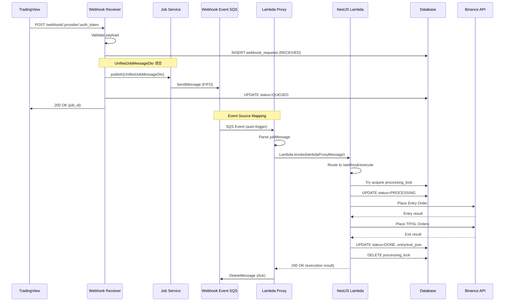

# Job Message & SQS Architecture

## Overview

Webhook 시스템은 **Common-API의 기존 Unified Job Queue 시스템**을 활용합니다.

> [!IMPORTANT]
> **기존 Job Queue 활용**
> 
> 이 문서는 `src/modules/job`에 구현된 Unified Job Queue 시스템을 webhook에 적용하는 방법을 설명합니다.
> Job Queue는 이미 `UnifiedJobMessageDto` 구조로 설계되어 있으며, webhook은 이 구조를 그대로 사용합니다.

---

## SQS Queue 구조

### Webhook Event Queue (신규 생성 필요)

**목적:** Event-driven Lambda trigger 전용  
**사용 사례:** TradingView webhook → 거래소 주문 실행  
**방법:** Common-API Queue의 SQS URL만 변경하여 사용 (좋은 Architecture 고려)

**Queue 설정:**
```yaml
Queue Type: FIFO
Queue Name: webhook-events.fifo
Message Deduplication: Content-based
Message Group ID: user_id (사용자별 순서 보장)
Visibility Timeout: 180s (3분)
DLQ: webhook-events-dlq.fifo
maxReceiveCount: 1
```

**Queue URL 예시:**
```
Common-API Queue: https://sqs.ap-northeast-2.amazonaws.com/123456789/common-api-jobs.fifo
Webhook Queue:    https://sqs.ap-northeast-2.amazonaws.com/123456789/webhook-events.fifo
```

> [!IMPORTANT]
> **Webhook 전용 SQS Queue 사용**
> 
> Webhook 시스템은 **별도의 SQS Queue URL**을 사용해야 합니다.
> - Common-API Queue: 일반 job 처리 (기존)
> - Webhook Queue: Webhook 전용 (신규 생성 필요)
> 
> **환경 변수:**
> ```bash
> AWS_SQS_QUEUE_URL=https://sqs.../common-api-jobs.fifo    # 기존
> WEBHOOK_SQS_QUEUE_URL=https://sqs.../webhook-events.fifo  # 신규 추가
> ```

---

## Unified Job Message Schema

### Standard Structure (UnifiedJobMessageDto)

기존 Job Queue 시스템의 표준 포맷을 사용합니다.

```typescript
interface UnifiedJobMessageDto {
  lambdaProxyMessage: LambdaProxyMessageDto;
  execution: ExecutionConfigDto;
  metadata: JobMetadataDto;
}
```

---

### 1. Lambda Proxy Message

Lambda proxy event 구조 (API Gateway/Function URL 호환)

```typescript
interface LambdaProxyMessageDto {
  body: string | null;              // JSON stringified payload
  resource: string;                 // "/{proxy+}"
  path: string;                     // "/webhook/execute"
  httpMethod: string;               // "POST" | "GET" | "PUT" | "DELETE"
  isBase64Encoded: boolean;
  pathParameters: Record<string, string>;
  queryStringParameters?: Record<string, string>;
  headers: Record<string, string>;
  requestContext: {
    path: string;
    resourcePath: string;
    httpMethod: string;
  };
}
```

---

### 2. Execution Config

실행 타입 및 타겟 설정

```typescript
interface ExecutionConfigDto {
  type: ExecutionType; // "lambda-invoke" | "lambda-url" | "rest-api" | "schedule"
  
  // lambda-invoke specific
  functionName?: string;            // "common-api-nestjs"
  invocationType?: InvocationType;  // "Event" | "RequestResponse"
  
  // lambda-url specific (사용 안 함)
  functionUrl?: string;
  
  // rest-api specific (사용 안 함)
  baseUrl?: string;
  
  // schedule specific (사용 안 함)
  scheduledAt?: string;
  scheduleExpression?: string;
  targetJob?: Record<string, any>;
}
```

**Webhook용 설정:**
```typescript
execution: {
  type: "lambda-invoke",
  functionName: "common-api-nestjs",
  invocationType: "RequestResponse"  // 동기 호출
}
```

---

### 3. Job Metadata

추적 및 메타데이터

```typescript
interface JobMetadataDto {
  jobId?: string;                   // Job UUID (DB 저장용)
  appId?: string;                   // Multi-tenancy App UUID
  idempotencyKey?: string;          // 중복 방지 키 (signal_id 사용)
  messageGroupId: string;           // SQS FIFO Message Group ID
  createdAt: string;                // ISO 8601 timestamp
  retryCount?: number;              // 재시도 횟수 (사용 안 함)
}
```

**Webhook용 설정:**
```typescript
metadata: {
  jobId: "550e8400-...",            // UUID
  appId: "user-app-id",
  idempotencyKey: signal_id,        // TradingView signal_id
  messageGroupId: user_id.toString(), // 사용자별 FIFO 순서 보장
  createdAt: new Date().toISOString(),
  retryCount: 0
}
```

---

## Webhook Execution Payload

### Webhook 요청을 Job Message로 변환

**원본 Webhook 요청:**
```json
{
  "exchange": "binance",
  "market": "futures_um",
  "ticker": "BTCUSDT",
  "action": "open_long",
  "qty": { "type": "percent", "value": 50 },
  "strategy": {
    "stop_loss": { "type": "percent", "value": 2.0 },
    "take_profit": { "type": "percent", "value": 5.0 }
  },
  "options": {
    "leverage": 10,
    "signal_id": "1737360000000"
  }
}
```

**변환된 Job Message:**
```json
{
  "lambdaProxyMessage": {
    "body": "{\"user_id\":1,\"signal_id\":\"1737360000000\",\"provider\":\"binance\",\"request\":{...}}",
    "resource": "/{proxy+}",
    "path": "/webhook/execute",
    "httpMethod": "POST",
    "isBase64Encoded": false,
    "pathParameters": {
      "proxy": "webhook/execute"
    },
    "headers": {
      "Content-Type": "application/json",
      "X-User-Id": "1",
      "X-Signal-Id": "1737360000000"
    },
    "requestContext": {
      "path": "/webhook/execute",
      "resourcePath": "/{proxy+}",
      "httpMethod": "POST"
    }
  },
  "execution": {
    "type": "lambda-invoke",
    "functionName": "common-api-nestjs",
    "invocationType": "RequestResponse"
  },
  "metadata": {
    "jobId": "550e8400-e29b-41d4-a716-446655440000",
    "appId": "user-1-app",
    "idempotencyKey": "1737360000000",
    "messageGroupId": "1",
    "createdAt": "2026-01-20T10:00:00.000Z",
    "retryCount": 0
  }
}
```

---

## Lambda Event Source Mapping Configuration

### Lambda Proxy (SQS → NestJS Lambda)

**Function Name:** `webhook-sqs-proxy`  
**Runtime:** Node.js 20.x  
**Memory:** 256MB (간단한 proxy이므로 작게)  
**Timeout:** 180s

**Event Source:**
```yaml
Event Source: Webhook Event SQS (FIFO)
Batch Size: 1                     # 한 번에 1개씩
Batch Window: 0                   # 즉시 처리
Maximum Concurrency: 10
Function Response Types: ReportBatchItemFailures
```

**Lambda Handler:**
```typescript
import { SQSEvent } from 'aws-lambda';
import { Lambda, InvokeCommand } from '@aws-sdk/client-lambda';

const lambda = new Lambda({});

export async function handler(event: SQSEvent) {
  const failedItems = [];
  
  for (const record of event.Records) {
    try {
      const jobMessage = JSON.parse(record.body);
      
      // NestJS Lambda 직접 invoke
      const response = await lambda.send(new InvokeCommand({
        FunctionName: jobMessage.execution.functionName,
        InvocationType: jobMessage.execution.invocationType || 'RequestResponse',
        Payload: JSON.stringify(jobMessage.lambdaProxyMessage)
      }));
      
      // 응답 확인
      const result = JSON.parse(new TextDecoder().decode(response.Payload));
      
      if (response.StatusCode !== 200 || result.statusCode >= 400) {
        console.error('Execution failed', { jobMessage, result });
        // 실패 시 알림 (Discord/Slack)
        await sendAlert({ type: 'EXECUTION_FAILED', jobMessage, result });
      }
      
    } catch (error) {
      console.error('Lambda proxy error', { error, record });
      failedItems.push({ itemIdentifier: record.messageId });
      await sendAlert({ type: 'PROXY_ERROR', error, record });
    }
  }
  
  return { batchItemFailures: failedItems };
}
```

---

## Execution Flow



---

## Job Service Integration

### Webhook Receiver에서 Job 발행

```typescript
import { Injectable } from '@nestjs/common';
import { JobService } from '@modules/job/job.service';
import { ExecutionType } from '@common/enums';
import { ConfigService } from '@nestjs/config';
import { randomUUID } from 'crypto';

@Injectable()
export class WebhookReceiverService {
  // Default App ID for webhook system
  private readonly DEFAULT_WEBHOOK_APP_ID = 'eb3fcbb2-7bb3-4ac7-aa38-1cb4bf00e405';
  
  constructor(
    private readonly jobService: JobService,
    private readonly configService: ConfigService
  ) {}
  
  async handleWebhook(
    userId: number,
    provider: string,
    authToken: string,
    payload: WebhookPayload
  ) {
    // 1. UnifiedJobMessage 생성
    const jobMessage = {
      lambdaProxyMessage: {
        body: JSON.stringify({
          user_id: userId,
          signal_id: payload.options.signal_id,
          provider,
          request: payload
        }),
        resource: '/{proxy+}',
        path: '/webhook/execute',
        httpMethod: 'POST',
        isBase64Encoded: false,
        pathParameters: { proxy: 'webhook/execute' },
        headers: {
          'Content-Type': 'application/json',
          'X-User-Id': userId.toString(),
          'X-Signal-Id': payload.options.signal_id
        },
        requestContext: {
          path: '/webhook/execute',
          resourcePath: '/{proxy+}',
          httpMethod: 'POST'
        }
      },
      execution: {
        type: ExecutionType.LAMBDA_INVOKE,
        functionName: this.configService.get('webhook.targetLambdaName'),
        invocationType: 'RequestResponse'
      },
      metadata: {
        jobId: randomUUID(),
        appId: this.DEFAULT_WEBHOOK_APP_ID,  // Default App ID 사용
        idempotencyKey: payload.options.signal_id,
        messageGroupId: userId.toString(),
        createdAt: new Date().toISOString(),
        retryCount: 0
      }
    };
    
    // 2. JobService.sendToSqs 사용 (webhook queue URL 전달)
    const webhookQueueUrl = this.configService.get<string>('webhook.sqsQueueUrl');
    await this.jobService.sendToSqs(jobMessage, webhookQueueUrl);
    
    return { job_id: jobMessage.metadata.jobId };
  }
}
```

> [!NOTE]
> **JobService.sendToSqs 수정 필요**
> 
> `JobService.sendToSqs`를 public으로 변경하고 optional queueUrl parameter를 추가해야 합니다:
> 
> ```typescript
> // src/modules/job/job.service.ts
> async sendToSqs(
>   message: UnifiedJobMessageDto,
>   queueUrl?: string  // Optional parameter 추가
> ): Promise<void> {
>   const url = queueUrl || this.configService.get<string>('aws.sqs.queueUrl');
>   
>   if (!url) {
>     throw new Error('SQS queue URL not configured');
>   }
>   
>   try {
>     const command = new SendMessageCommand({
>       QueueUrl: url,
>       MessageBody: JSON.stringify(message),
>       MessageGroupId: `${message.metadata.messageGroupId}-${message.metadata.jobId}`,
>       MessageDeduplicationId: message.metadata.idempotencyKey || `${message.metadata.jobId}-${Date.now()}`
>     });
>     
>     const response = await this.sqsClient.send(command);
>     this.logger.log(`Message sent to SQS: jobId=${message.metadata.jobId}, queue=${url}`);
>     return response;
>   } catch (error) {
>     this.logger.error(`Failed to send message to SQS: ${error.message}`, error.stack);
>     throw error;
>   }
> }
> ```

**환경 변수 설정:**
```bash
# .env
WEBHOOK_SQS_QUEUE_URL=https://sqs.ap-northeast-2.amazonaws.com/123456789/webhook-events.fifo
WEBHOOK_TARGET_LAMBDA_NAME=common-api-nestjs
DEFAULT_WEBHOOK_APP_ID=eb3fcbb2-7bb3-4ac7-aa38-1cb4bf00e405
```

---

## DLQ Policy

> [!CAUTION]
> **DLQ 필요성 검토**
> 
> Webhook 시스템은 **재시도 없음** 정책을 사용합니다.
> 
> - 거래소 API 오류 → DB FAIL 기록 + 알림
> - Lock conflict → 정상 동작 (다른 Lambda 처리 중)
> - Lambda proxy 크래시 → DLQ 이동
> 
> **DLQ는 Lambda proxy 자체 오류에만 사용됩니다.**

**설정:**
```yaml
maxReceiveCount: 1                # 1회만 시도
DLQ: webhook-events-dlq.fifo
Redrive: Manual (Admin API)
```

**DLQ 메시지는 Admin이 확인 후 수동 재처리**

---

## Error Handling & Alerts

### 실패 시 동작

1. **거래소 API 오류**
   - DB FAIL 상태 기록
   - Discord/Slack 알림
   - 재시도 없음

2. **Lambda Proxy 오류**
   - DLQ로 이동
   - PagerDuty 긴급 알림
   - Admin 수동 확인

3. **Lock Conflict**
   - 정상 동작 (다른 처리 중)
   - 로그만 기록

---

## Monitoring & Metrics

### CloudWatch Metrics

**Custom Metrics:**
- `WebhookJobPublished` (count)
- `LambdaProxyInvoked` (count)
- `ExecutionSuccess` (count)
- `ExecutionFailed` (count)

**Lambda Metrics:**
- `webhook-sqs-proxy` Duration, Errors
- `common-api-nestjs` Duration, Errors

### Alarms

```yaml
Proxy Lambda 에러:
  Metric: Errors
  Threshold: > 1
  Action: PagerDuty

DLQ 메시지:
  Metric: ApproximateNumberOfMessagesVisible
  Threshold: > 0
  Action: Slack + PagerDuty

실행 실패율:
  Metric: ExecutionFailed / ExecutionSuccess
  Threshold: > 0.1 (10%)
  Action: Discord 알림
```

---

## Cost Optimization

### SQS + Lambda Costs

**월 100만 webhook 요청 기준:**

**SQS FIFO:**
- $0.50 per 1M requests
- Total: $0.50/month

**Lambda Proxy:**
- 256MB, 0.1초 실행
- (1M requests × 0.1s × 256MB) ÷ 1024 = 25,000 GB-s
- $0.0000166667 per GB-s
- Total: ~$0.42/month

**NestJS Lambda:**
- 512MB, 2초 평균 실행
- (1M requests × 2s × 512MB) ÷ 1024 = 1,000,000 GB-s
- Total: ~$16.67/month

**Total: ~$17.60/month** (100만 요청 기준)

---

## Migration Notes

이전 문서에서 제안한 커스텀 job message 구조는 사용하지 않습니다.  
대신 **기존 UnifiedJobMessageDto 구조를 그대로 활용**합니다.

**장점:**
- ✅ 기존 Job Queue 인프라 재사용
- ✅ 일관된 job 처리 패턴
- ✅ 다른 job 타입과 통합 가능
- ✅ 코드 중복 최소화
